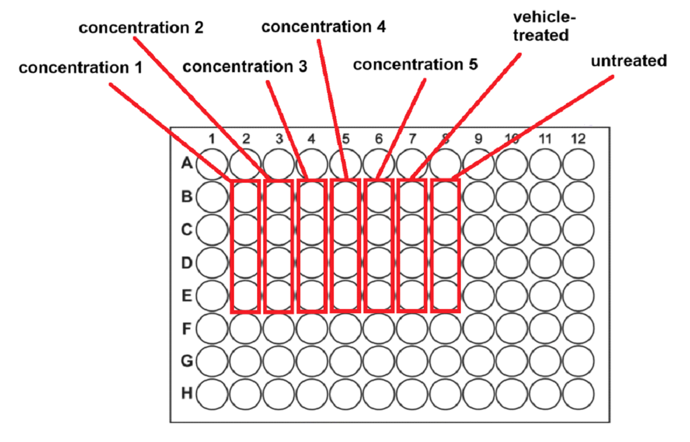
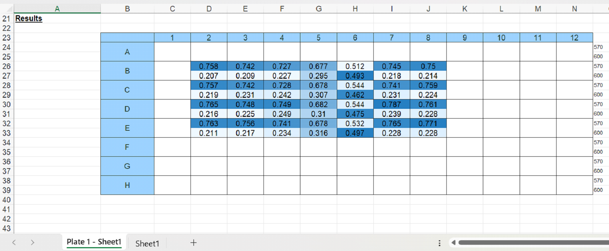
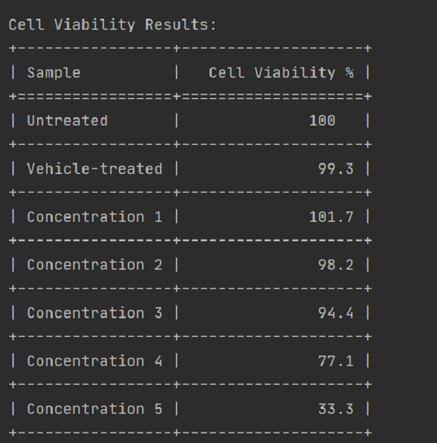

# AlamarBlue Cell Viability Assay Analysis Script

## Description

The **alamarBlue** assay is a widely used method for assessing cell proliferation and cytotoxicity across various human and animal cell lines, as well as bacteria and fungi. This reagent utilizes an oxidation-reduction (REDOX) indicator dye that fluoresces and changes color in response to the chemical reduction of the growth medium, which occurs as cells metabolize and grow.

At the core of the assay is **resazurin**, a REDOX-sensitive dye that undergoes a colorimetric shift when reduced by cellular activity. The reduced form, resorufin, appears pink and is highly fluorescent, with fluorescence intensity correlating directly with the number of metabolically active cells. By monitoring these changes, alamarBlue serves as an indicator of cell health, providing quantitative measurements of cell viability and cytotoxicity.

This Python script automates the analysis of alamarBlue assay data exported from a plate reader, streamlining the calculation of cell viability percentages.

## Laboratory Procedure Overview

Cells are seeded in 96-well plates and incubated with the test agent for the desired amount of time. After incubation, the media containing the test agent is replaced with media containing 10% alamarBlue reagent. Following a 4–8 hour incubation, absorbance is measured at 570 nm and 600 nm. For processing with this Python script, the data should be exported as an Excel file (.xlsx, .xlsm, or .xls formats are supported).

## Script Features

1. **Automated Analysis:** Simplifies the processing of alamarBlue assay data by automating calculations. Typically, organizing and performing all the necessary calculations in Excel file to process six samples and a control can take about **half an hour**. With this script, you can obtain results in **less than a minute**. The only time you need to interact with the Excel file is when the script opens it for you to select data ranges during the prompts.

2. **Flexible Replicates Handling:** Recognizes technical replicates arranged in the same vertical column in the 96-well plate (e.g., wells A8, B8, C8, D8).

3. **Variable Replicate Numbers:** Supports any number of replicates from 1 to 8 per sample, with different samples allowed to have different numbers of replicates.

4. **Outlier Detection:** Offers an option to exclude outliers based on the interquartile range (IQR) method (values outside 1.5 × IQR).

5. **Results Output:** Generates a table with cell viability percentages relative to the positive control (set as 100% viability).

6. **Data Export:** Optionally saves the results to a Word document.

## Calculation Method

The calculations used in the script are based on the method for measuring cytotoxicity or proliferation using alamarBlue by spectrophotometry, as provided on the [Bio-Rad website](https://www.bio-rad-antibodies.com/measuring-cytotoxicity-proliferation-spectrophotometry-fluorescence-alamarblue.html).

## Example Experiment

We measured cell viability after 24 hours of incubation with different concentrations of **Inhibitor X**. Cells were treated with five different inhibitor concentrations, with four technical replicates (wells) per treatment. We also included an untreated positive control and a vehicle-treated control (DMSO).

### Plate Scheme

### Data Format

After spectrophotometry, the data were exported to an Excel file. The plate data appeared as follows:

Each cell in the Excel file represents a well in the 96-well plate and contains two numbers:

- Upper number: Absorbance measured at 570 nm.

- Lower number: Absorbance measured at 600 nm.

## Usage Instructions

1. **Launch the Script:** Run the Python script in your preferred environment.

2. **Select the Excel File:** A file dialog will open; select the Excel file containing your assay data.

3. **Input Parameters:**

   - Enter the sheet name when prompted.

   - Specify the number of samples.

   - Provide names for each sample.

4. **Select Sample Ranges:**

   - For each sample, the script will open the Excel file.

   - Use the mouse to select the cell range (within a column) corresponding to the sample's replicates.

   - Return to the script window and press `Enter` to continue.

5. **Outlier Removal:** Indicate whether you want to exclude outliers from the calculations.

6. **View Results:** The script will display a table with cell viability percentages for each sample, relative to the positive control.

7. **ave Results:** Optionally, you can save the results to a Word document.

## Output Example

Here is the output table generated by the script for our data (with outliers removed):

> [!NOTE]
>
> - The script assumes that replicates are arranged in the same vertical column in the Excel file.
> - Ensure that your data is correctly formatted, with absorbance readings at 570 nm and 600 nm in each cell.
> - Outliers are determined using the IQR method, where values outside 1.5 × IQR are excluded if you choose to remove outliers
